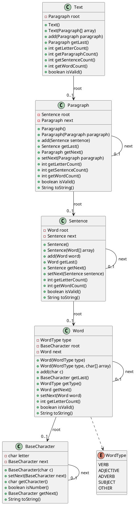

## Java implementation for Text composer

This implementation is based on linked list following this UML:   

PlantUML code:

```plantuml
@startuml

class BaseCharacter {
    - char letter
    - BaseCharacter next
    + BaseCharacter(char c)
    + setNext(BaseCharacter next)
    + char getCharacter()
    + boolean isNumber()
    + BaseCharacter getNext()
    + String toString()
}

class Word {
    - WordType type
    - BaseCharacter root
    - Word next
    + Word(WordType type)
    + Word(WordType type, char[] array)
    + add(char c)
    + BaseCharacter getLast()
    + WordType getType()
    + Word getNext()
    + setNext(Word word)
    + int getLetterCount()    
    + boolean isValid()
    + String toString()    
}

class Sentence {
    - Word root
    - Sentence next
    + Sentence()
    + Sentence(Word[] array)
    + add(Word word)
    + Word getLast()
    + Sentence getNext()
    + setNext(Sentence sentence)
    + int getLetterCount()
    + int getWordCount()    
    + boolean isValid()
    + String toString()    
}

class Paragraph {
    - Sentence root
    - Paragraph next
    + Paragraph()
    + Paragraph(Paragraph paragraph)
    + add(Sentence sentence)
    + Sentence getLast()
    + Paragraph getNext()
    + setNext(Paragraph paragraph)
    + int getLetterCount()
    + int getSentenceCount()
    + int getWordCount()    
    + boolean isValid()
    + String toString()    
}

class Text {
    - Paragraph root
    + Text()
    + Text(Paragraph[] array)
    + add(Paragraph paragraph)
    + Paragraph getLast()
    + int getLetterCount()
    + int getParagraphCount()
    + int getSentenceCount()
    + int getWordCount()
    + boolean isValid()    
}

enum WordType {
    VERB
    ADJECTIVE
    ADVERB
    SUBJECT
    OTHER
}

Text  --> "0..1" Paragraph : "root"
Paragraph -- "0..1" Paragraph : "next"
Paragraph  --> "0..1" Sentence : "root"
Sentence -- "0..1" Sentence : "next"
Sentence  --> "0..1" Word  : "root"
Word -- "0..1" Word : "next"
Word  --> "0..1" BaseCharacter  : "root"
BaseCharacter -- "0..1" BaseCharacter : "next"
Word ..> WordType

@enduml
```